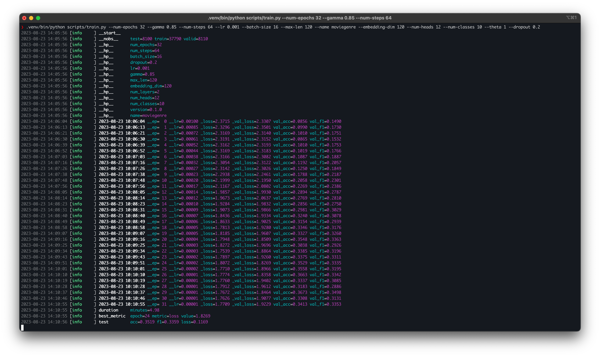
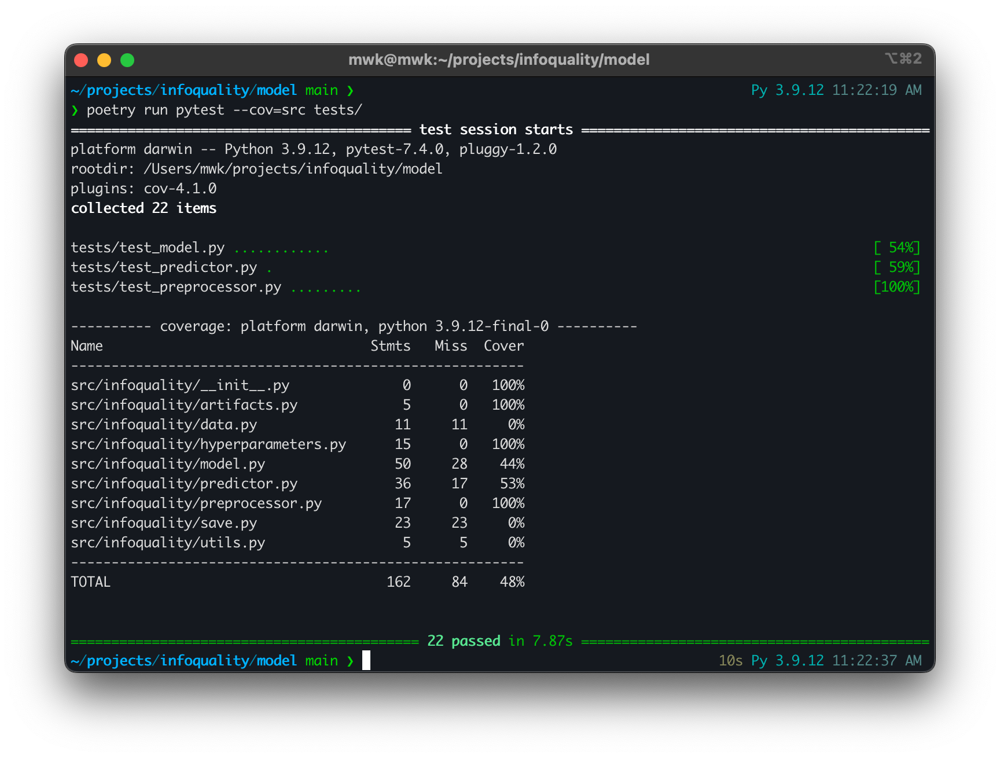

# Information Quality

An NLP transformer model for classifying the quality of natural language as "high" or "low"

## Installation

```bash
make develop
```

## Testing

```bash
make test
```

## Usage

```bash
python scripts/train.py \
    --num-epochs 16 \
    --gamma 0.7 \
    --num-steps 36 \
    --lr 0.0002 \
    --batch-size 36 \
    --name imdbsent \
    --embedding-dim 256
```

## Training



## Testing


